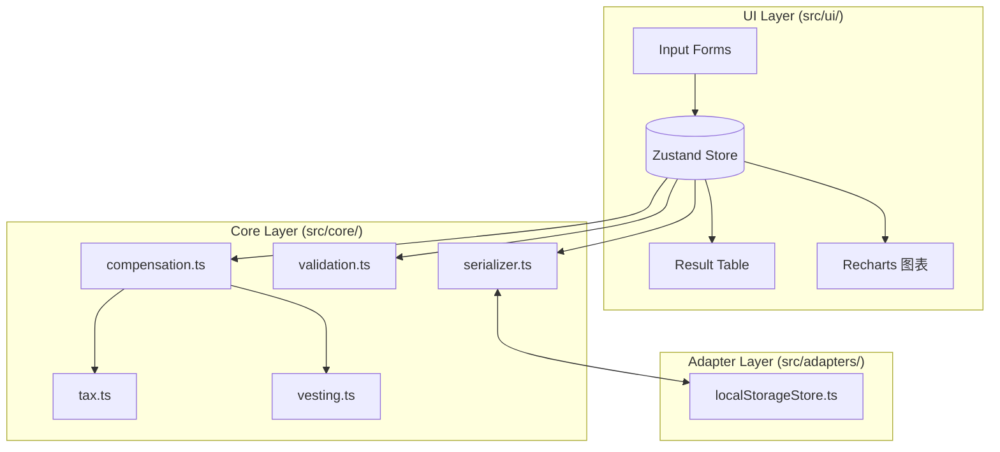

# Design Document

## Overview

本设计覆盖 `amazon-annual-compensation-viewer` 的端到端实现方案。功能范围由 `requirements.md` 中的 R1–R12 约束，核心能力为：录入 Base / Sign-on / RSU / Stock_Price / FX_Rate / vesting 计划 → 按中国税法（R7 单独计税、R8 20% 资本利得）计算年度 Gross / Net / 税金 → 图表展示并持久化到浏览器。此外模型支持年度免税补贴（餐饮 / 花费 / 住房）的录入与展示，它们计入 Gross/Net，但不并入 Withholding_Tax 的计税基数（R7 / R12）。

设计原则：

- **纯前端 SPA + 静态托管**：无后端服务器、无数据库；所有状态驻留在浏览器内存 + localStorage。
- **纯函数的计算核心**：税金、vesting、薪酬推算集中在 `src/core/`，无副作用、无 UI 依赖，便于后续 Property-Based Testing。
- **适配器隔离外部 I/O**：localStorage 由 `src/adapters/` 下的适配器包装，核心层不直接依赖 `window.localStorage`。
- **无外部 API 依赖**：股价与汇率均为 User 手动输入，应用可完全离线运行。
- **序列化 round-trip 契约**：持久化格式显式版本化（`{ version: 1, plan: ... }`），Zod schema 同时充当运行时校验与 TypeScript 类型来源。

## Architecture

### 分层



三层职责：

- **Core（纯函数层）**：输入是已校验的 TypeScript 对象，输出是数值或数值序列；不访问 `window`、`localStorage` 或任何 React API。
- **Adapters（副作用边界）**：将外部世界（浏览器存储）封装成同步函数；负责错误归一化。
- **UI（展示与编排）**：React 组件 + Zustand 管理 UI 状态，组合 Core + Adapters，把计算结果交给图表与表格。

### 数据流

```mermaid
flowchart LR
    U[User 输入] -->|validate| V[validation.ts]
    V -->|valid input| S[Zustand Store]
    LS[(localStorage)] -->|加载| S
    S -->|CompensationPlan| C[computeAnnualCompensation]
    C --> R[ComputedYear[]]
    R --> T[表格/图表]
    S -->|保存| LS
```

### 目录结构

```
src/
├── core/
│   ├── compensation.ts      # 年度汇总
│   ├── tax.ts               # Withholding / Capital Gains
│   ├── vesting.ts           # vesting 计划与股数
│   ├── validation.ts        # 输入校验
│   ├── serializer.ts        # plan ↔ JSON
│   └── constants.ts         # TAX_BRACKETS / DEFAULT_VESTING / ALLOWANCE 默认值
├── adapters/
│   └── localStorageStore.ts
├── ui/
│   ├── App.tsx
│   ├── store.ts             # Zustand
│   ├── forms/
│   ├── result/
│   └── chart/
├── types.ts                 # 共享类型 + Zod schema
└── main.tsx
```

## Tech Stack

| 选型 | 理由 |
| --- | --- |
| React 18 + TypeScript | 生态成熟、类型安全；与 Vite / Recharts / Zustand 无缝配合 |
| Vite | 启动快、HMR 好、原生 ESM、与静态托管（GitHub Pages / Vercel）契合 |
| Zustand | 轻量状态管理，无需 Provider 包裹；store 可在 React 之外被测试调用 |
| Zod | 运行时 schema 校验，同时自动派生 TS 类型；服务 R10 AC 3（损坏数据降级）与 R11（校验） |
| Recharts | 声明式图表，满足 R9 AC 5（柱状/折线） |
| Vitest + fast-check | 单测与 PBT 一体；与 Vite 共享配置 |

## Data Model

所有类型既是 TypeScript 类型，也由 Zod schema 在运行时校验。下列定义置于 `src/types.ts`。

```ts
import { z } from 'zod';

// ---------- 输入：单笔卖出（R8） ----------
export const SellRecordSchema = z.object({
  sellPriceUsd: z.number().finite().nonnegative(),
  sellQuantity: z.number().int().nonnegative(),
});
export type SellRecord = z.infer<typeof SellRecordSchema>;

// ---------- 输入：单个年度 ----------
export const YearInputSchema = z.object({
  // 相对上一年度的 raise 百分比；首年可为 0
  raiseRate: z.number().finite().min(0).max(100),
  // 该年度 Sign-on（CNY）
  signOnBonus: z.number().finite().nonnegative(),
  // 该年度 vesting 比例（百分数 0–100）
  vestingPct: z.number().finite().min(0).max(100),
  // 该年度 vesting 当日 FMV（USD/股）；未提供则兜底为当前 Stock_Price
  vestingFmvUsd: z.number().finite().positive().optional(),
  // 该年度的卖出记录
  sells: z.array(SellRecordSchema).default([]),
  // R12：三项年度免税补贴（CNY）。均为可选——未提供时由 Core 层根据规则填充默认值
  // （Housing 的默认值依赖年度序号，因此不使用 Zod 的 `.default()`）。
  mealAllowance: z.number().finite().nonnegative().optional(),
  miscellaneousAllowance: z.number().finite().nonnegative().optional(),
  housingAllowance: z.number().finite().nonnegative().optional(),
});
export type YearInput = z.infer<typeof YearInputSchema>;

// ---------- Compensation Plan ----------
export const CompensationPlanSchema = z.object({
  startYear: z.number().int().min(2000).max(2100),
  baseSalaryStart: z.number().finite().nonnegative(),
  rsuGrant: z.number().int().nonnegative(),
  // R5 AC 2：FX_Rate 使用前必须存在
  fxRate: z.number().finite().positive().optional(),
  // R4 AC 2：Stock_Price 使用前必须存在（由 User 手动输入）
  stockPriceUsd: z.number().finite().positive().optional(),
  years: z.array(YearInputSchema).min(1),
  // R7 AC 7：关闭代扣税
  disableWithholdingTax: z.boolean().default(false),
}).superRefine((plan, ctx) => {
  const total = plan.years.reduce((s, y) => s + y.vestingPct, 0);
  if (total > 100 + 1e-6) {
    ctx.addIssue({
      code: z.ZodIssueCode.custom,
      path: ['years'],
      message: `Vesting 百分比之和 ${total}% 超过 100%`,
    });
  }
});
export type CompensationPlan = z.infer<typeof CompensationPlanSchema>;

// ---------- 持久化信封（版本化） ----------
export const PersistedEnvelopeSchema = z.object({
  version: z.literal(1),
  plan: CompensationPlanSchema,
});
export type PersistedEnvelope = z.infer<typeof PersistedEnvelopeSchema>;

// ---------- 单笔卖出的计算结果 ----------
export interface CapitalGainsEntry {
  sellPriceUsd: number;
  sellQuantity: number;
  costBasisUsd: number;
  capitalGainsUsdRaw: number;  // 未取 max(0, …)
  capitalGainsTaxCny: number;  // 应纳税额（取 max 0 后）
}

// ---------- 年度计算结果 ----------
export interface ComputedYear {
  year: number;              // 绝对年份
  baseSalaryCny: number;
  signOnBonusCny: number;
  vestedShares: number;
  stockValueCny: number | null;    // FX_Rate 或 Stock_Price 缺失时为 null（R4 AC 3 / R5 AC 3）
  taxableRsuIncomeCny: number | null;
  withholdingTaxCny: number | null;
  // R12：三项免税补贴与其合计（CNY）。不依赖 FX_Rate / Stock_Price，始终非 null。
  mealAllowanceCny: number;
  miscellaneousAllowanceCny: number;
  housingAllowanceCny: number;
  totalAllowancesCny: number;
  grossAnnualCny: number | null;
  // R12 设计决策：当 `stockValueCny === null`（FX_Rate 或 Stock_Price 缺失）时，
  // 仍可给出不含 Stock 的部分 gross，便于 UI 展示部分薪酬信息。
  // `grossAnnualCny` 的空/非空语义保持不变（仍表示完整 gross）。
  partialGrossWithoutStockCny: number;
  netAnnualCny: number | null;
  capitalGains: CapitalGainsEntry[];
  warnings: string[];              // 例如 "优惠政策到期"、"数据不完整"、"缺少股价"、"缺少汇率"
}

// ---------- 税率级距常量 ----------
export interface TaxBracket {
  upperBound: number | null; // CNY；null 表示 +∞
  rate: number;              // 0–1
  quickDeduction: number;    // CNY
}
```

### `TAX_BRACKETS` 常量（R7 AC 2，源自 Glossary 表）

```ts
// src/core/constants.ts
import type { TaxBracket } from '../types';

export const TAX_BRACKETS: readonly TaxBracket[] = [
  { upperBound:  36_000, rate: 0.03, quickDeduction:      0 },
  { upperBound: 144_000, rate: 0.10, quickDeduction:  2_520 },
  { upperBound: 300_000, rate: 0.20, quickDeduction: 16_920 },
  { upperBound: 420_000, rate: 0.25, quickDeduction: 31_920 },
  { upperBound: 660_000, rate: 0.30, quickDeduction: 52_920 },
  { upperBound: 960_000, rate: 0.35, quickDeduction: 85_920 },
  { upperBound:    null, rate: 0.45, quickDeduction: 181_920 },
] as const;

// R3 AC 8：Amazon 默认 vesting 模板
export const DEFAULT_AMAZON_VESTING_PCT = [5, 15, 40, 40] as const;

// R12 AC 2：餐饮补贴默认年化
export const MEAL_ALLOWANCE_DEFAULT_CNY = 10 * 21.75 * 12; // = 2,610

// R12 AC 3：花费补贴默认年化
export const MISC_ALLOWANCE_DEFAULT_CNY = 50 * 12; // = 600

// R12 AC 4–5：住房补贴默认值（按 0 基索引的年度序号）
export function defaultHousingAllowanceForYearIndex(i: number): number {
  return i < 2 ? 6400 : 0;
}

// R7 AC 6：境外股权激励单独计税优惠到期日
export const SINGLE_TAX_BENEFIT_EXPIRY = '2027-12-31';
```

## Core Computation

### 签名

```ts
// src/core/vesting.ts
export function computeVestedShares(rsuGrant: number, vestingPct: number): number;

// src/core/compensation.ts
export function projectBaseSalaries(startBase: number, raiseRates: number[]): number[];
export function computeStockValueCny(
  vestedShares: number,
  stockPriceUsd: number,
  fxRate: number,
): number;

// src/core/tax.ts
export function computeWithholdingTax(taxableRsuIncomeCny: number): number;
export function computeCapitalGainsTaxCny(
  sellPriceUsd: number,
  costBasisUsd: number,
  quantity: number,
  fxRate: number,
): number;

// src/core/compensation.ts（顶层）
export function computeAnnualCompensation(
  plan: CompensationPlan,
): ComputedYear[];
```

### 公式实现（伪代码）

**`projectBaseSalaries`（R1 AC 3 / AC 6）**

```ts
function projectBaseSalaries(startBase, raiseRates) {
  const out = [];
  let current = startBase;
  for (const r of raiseRates) {
    current = current * (1 + r / 100);
    out.push(round2(current));
  }
  // 注意：首年 raise 解释为"相对起薪的第 1 年调整"；若希望首年 = startBase，可在 UI 将 years[0].raiseRate 默认 0。
  return out;
}
```

**`computeVestedShares`（R3 AC 3）**

```ts
function computeVestedShares(rsuGrant, vestingPct) {
  return rsuGrant * (vestingPct / 100);
}
```

**`computeStockValueCny`（R6 AC 1）**

```ts
function computeStockValueCny(vestedShares, stockPriceUsd, fxRate) {
  return round2(vestedShares * stockPriceUsd * fxRate);
}
```

**`computeWithholdingTax`（R7 AC 2–3）**

```ts
function computeWithholdingTax(taxableRsuIncomeCny) {
  if (taxableRsuIncomeCny <= 0) return 0;
  const bracket = TAX_BRACKETS.find(
    (b) => b.upperBound === null || taxableRsuIncomeCny <= b.upperBound
  )!;
  const tax = taxableRsuIncomeCny * bracket.rate - bracket.quickDeduction;
  return round2(Math.max(0, tax));
}
```

**`computeCapitalGainsTaxCny`（R8 AC 2）**

```ts
function computeCapitalGainsTaxCny(sellPriceUsd, costBasisUsd, quantity, fxRate) {
  const gainUsd = Math.max(0, (sellPriceUsd - costBasisUsd) * quantity);
  return round2(gainUsd * fxRate * 0.20);
}
```

**`computeAnnualCompensation` 主循环**

```ts
function computeAnnualCompensation(plan) {
  const raiseRates = plan.years.map(y => y.raiseRate);
  const baseSeries = projectBaseSalaries(plan.baseSalaryStart, raiseRates);

  const stockPriceUsd = plan.stockPriceUsd; // 由 User 手动输入（R4）

  // R8 AC 4：剩余可卖股数按年度单独追踪
  return plan.years.map((y, i) => {
    const year = plan.startYear + i;
    const vestedShares = computeVestedShares(plan.rsuGrant, y.vestingPct);
    const warnings: string[] = [];

    // R12：三项免税补贴（始终可得，与 FX_Rate / Stock_Price 无关）
    const mealAllowanceCny = y.mealAllowance ?? MEAL_ALLOWANCE_DEFAULT_CNY;
    const miscellaneousAllowanceCny =
      y.miscellaneousAllowance ?? MISC_ALLOWANCE_DEFAULT_CNY;
    const housingAllowanceCny =
      y.housingAllowance ?? defaultHousingAllowanceForYearIndex(i);
    const totalAllowancesCny = round2(
      mealAllowanceCny + miscellaneousAllowanceCny + housingAllowanceCny,
    );

    const missingFx = plan.fxRate === undefined;
    const missingPrice = stockPriceUsd === undefined;

    let stockValueCny: number | null = null;
    let taxableRsuIncomeCny: number | null = null;
    let withholdingTaxCny: number | null = null;

    if (!missingFx && !missingPrice) {
      stockValueCny = computeStockValueCny(vestedShares, stockPriceUsd!, plan.fxRate!);
      const fmv = y.vestingFmvUsd ?? stockPriceUsd!; // R3 Glossary：Vesting_FMV 兜底
      taxableRsuIncomeCny = round2(vestedShares * fmv * plan.fxRate!);
      // Allowances 不并入 Taxable_RSU_Income（R12 AC 8 / R7 AC 4）
      withholdingTaxCny = plan.disableWithholdingTax
        ? 0
        : computeWithholdingTax(taxableRsuIncomeCny);
      if (year >= 2028) warnings.push('优惠政策到期提醒');
    } else {
      warnings.push('数据不完整');
      if (missingPrice) warnings.push('缺少股价');
      if (missingFx) warnings.push('缺少汇率');
    }

    // 资本利得（R8）
    const capitalGains: CapitalGainsEntry[] = y.sells.map(s => {
      const costBasisUsd = y.vestingFmvUsd ?? stockPriceUsd ?? 0;
      return {
        sellPriceUsd: s.sellPriceUsd,
        sellQuantity: s.sellQuantity,
        costBasisUsd,
        capitalGainsUsdRaw: (s.sellPriceUsd - costBasisUsd) * s.sellQuantity,
        capitalGainsTaxCny: missingFx
          ? 0
          : computeCapitalGainsTaxCny(s.sellPriceUsd, costBasisUsd, s.sellQuantity, plan.fxRate!),
      };
    });

    const grossAnnualCny =
      stockValueCny === null
        ? null
        : round2(baseSeries[i] + y.signOnBonus + stockValueCny + totalAllowancesCny);
    // R12：不含 Stock 的部分 gross，用于 FX_Rate / Stock_Price 缺失时的降级展示
    const partialGrossWithoutStockCny = round2(
      baseSeries[i] + y.signOnBonus + totalAllowancesCny,
    );
    const netAnnualCny =
      grossAnnualCny === null || withholdingTaxCny === null
        ? null
        : round2(grossAnnualCny - withholdingTaxCny);

    return {
      year,
      baseSalaryCny: baseSeries[i],
      signOnBonusCny: y.signOnBonus,
      vestedShares,
      stockValueCny,
      taxableRsuIncomeCny,
      withholdingTaxCny,
      mealAllowanceCny,
      miscellaneousAllowanceCny,
      housingAllowanceCny,
      totalAllowancesCny,
      grossAnnualCny,
      partialGrossWithoutStockCny,
      netAnnualCny,
      capitalGains,
      warnings,
    };
  });
}
```

`round2` 统一为 `Math.round(x * 100) / 100`，仅用于展示与 `ComputedYear` 的最终字段；内部中间量不提前舍入。

## Persistence

- **存储位置**：`localStorage`，固定 key `amzn-comp-plan-v1`。
- **信封格式**：`PersistedEnvelope = { version: 1, plan: CompensationPlan }`；`version` 为未来迁移预留。
- **写入路径**：`save(plan)` → `PersistedEnvelopeSchema.parse({ version: 1, plan })` → `JSON.stringify` → `localStorage.setItem`。Zod 校验失败时抛错由 UI 捕获并提示。
- **读取路径**：`load()` → `localStorage.getItem` →（缺失则返回 `null`） → `JSON.parse` + `PersistedEnvelopeSchema.safeParse`；任意一步失败 → 删除脏数据 → 返回 `null` → UI 展示"数据已重置"（R10 AC 3）。
- **Stock_Price 与 FX_Rate**：均作为 `CompensationPlan` 的字段持久化（R4 AC 6 / R5 AC 6）。
- **Round-trip 契约**：`serializer.parse(serializer.stringify(plan))` 对任意有效 plan 恒等，由 Zod schema 保证字段集合与类型（R10 AC 6，亦列入 Correctness Property 1）。

`src/core/serializer.ts` 对外签名：

```ts
export function stringifyPlan(plan: CompensationPlan): string;
export function parsePlan(raw: string):
  | { ok: true; plan: CompensationPlan }
  | { ok: false; reason: 'json' | 'schema' };
```

## Validation

所有规则在 `src/core/validation.ts` 的 Zod schema 内声明；UI 表单在 `onBlur` / `onChange` 触发 `.safeParse`，500ms 内返回（R11 AC 1）。校验失败的字段不会写入 Zustand store，且 `ComputedYear.warnings` 会推入 `"数据不完整"`（R11 AC 3）。

| 字段 | 规则 | 错误消息 | 对应 AC |
| --- | --- | --- | --- |
| `baseSalaryStart` | 有限数、≥ 0 | "起始 Base Salary 必须是非负数字" | R1 AC 5 |
| `years[i].raiseRate` | 有限数、0–100 | "普调比例需在 0%–100% 之间" | R1 AC 4 / AC 6 |
| `years[i].signOnBonus` | 有限数、≥ 0 | "Sign-on Bonus 必须是非负数字" | R2 AC 2 / AC 3 |
| `rsuGrant` | 整数、≥ 0 | "RSU 股数必须是非负整数" | R3 AC 4 |
| `years[i].vestingPct` | 有限数、0–100 | "Vesting 比例需在 0%–100% 之间" | R3 AC 5 / AC 7 |
| `Σ vestingPct` | ≤ 100 | "Vesting 百分比之和不能超过 100%" | R3 AC 6 |
| `years[i].vestingFmvUsd` | 有限数、> 0（可选） | "Vesting FMV 必须为正数" | R8 AC 2（间接） |
| `fxRate` | 有限数、> 0 | "USD→CNY 汇率必须为正数" | R5 AC 4 |
| `stockPriceUsd` | 有限数、> 0 | "AMZN 股价必须为正数" | R4 AC 4 |
| `sells[j].sellPriceUsd` | 有限数、≥ 0 | "卖出单价必须是非负数字" | R8 AC 5 |
| `sells[j].sellQuantity` | 整数、≥ 0，且 ≤ 该年度剩余可卖股数 | "卖出股数不得超过已确权未卖出的 X 股" | R8 AC 4 / AC 5 |
| `years[i].mealAllowance` | 有限数、≥ 0（可选） | "餐饮补贴必须是非负数字" | R12 AC 6 |
| `years[i].miscellaneousAllowance` | 有限数、≥ 0（可选） | "花费补贴必须是非负数字" | R12 AC 6 |
| `years[i].housingAllowance` | 有限数、≥ 0（可选） | "住房补贴必须是非负数字" | R12 AC 6 |

跨字段的剩余可卖股数校验由 `validation.ts` 的 `validatePlanSells(plan)` 承担（Zod 的 `superRefine`），在计算器外单独调用，以便 UI 按年度聚合报错。

## UI Layout

- **左栏（输入）**：全局字段（起始 Base / RSU 总数 / Stock_Price / FX_Rate / 默认 vesting 模板按钮） + 年度表格（每行：raise% / sign-on / vesting% / vesting FMV / 添加卖出 / 餐饮补贴 / 花费补贴 / 住房补贴）。三项补贴字段的占位符为各自的默认值（餐饮 2,610；花费 600；住房在 Year 1/Year 2 为 6,400，Year 3+ 为 0），User 留空时 Core 层填入默认值。
- **右栏（结果）**：
  - 顶部：Stock_Price 与 FX_Rate 概要（显示当前值；缺失时显示 "缺少股价" / "缺少汇率" 提示并高亮左栏输入框）。
  - 中部：结果表（每年 Base / Sign-on / Stock / Total_Allowances / Withholding / Gross / Net）。`Total_Allowances` 列插入在 Stock 与 Withholding 之间；该列 tooltip 展开显示 Meal / Misc / Housing 三项拆分。
  - 当 `stockValueCny === null` 时，该年度 Gross 单元格改为展示 `partialGrossWithoutStockCny` 并标注"不含 Stock Value"，Net 仍显示为缺省态。
  - 底部：Recharts 柱状 + 折线图（Gross vs Net）。
  - 每笔 Capital Gains 在展开行中单独列出，并带"卖出亏损不得结转抵扣其他所得"提示（R8 AC 7）。
- **状态与交互**：
  - Zustand store 保存 `plan`、`errors`；`computed` 派生通过 selector 在渲染时同步计算（避免过早 memo 化）。
  - 首次挂载：`load()` → 若命中则填充。
  - R4 AC 5 / R5 AC 5：`stockPriceUsd` 或 `fxRate` 变更立即重新渲染，Zustand 的订阅机制天然满足。
  - R7 AC 7：Checkbox 切换 `disableWithholdingTax`，UI 在受影响年度加 "已关闭代扣税" 标签。

## Correctness Properties

*A property is a characteristic or behavior that should hold true across all valid executions of a system—essentially, a formal statement about what the system should do. Properties serve as the bridge between human-readable specifications and machine-verifiable correctness guarantees.*

下列 property 由 fast-check 覆盖，每条至少 100 iterations。Generator 通常基于 `CompensationPlanSchema` 的字段约束构造（例如 `fc.double({ min: 0, max: 100, noNaN: true })`），需跨字段关系的在 generator 层用 `.filter` 或组合子保证前置条件。

### Property 1: Serializer round-trip

*For any* valid `CompensationPlan`, `parsePlan(stringifyPlan(plan))` SHALL return `{ ok: true, plan: plan' }` where `plan'` is deeply equal to `plan`.

**Validates: Requirements 10.6**

### Property 2: Withholding_Tax 非负、单调非递减、级距边界连续

*For any* two taxable RSU income values `a, b` (CNY, 有限非负) with `a ≤ b`, `computeWithholdingTax(a) ≥ 0`, `computeWithholdingTax(a) ≤ computeWithholdingTax(b)`, 且在级距上界附近（`b_k` 与 `b_k + ε`）二者差的绝对值不超过 0.01 CNY（分位舍入容忍）。

**Validates: Requirements 7.3**

### Property 3: Withholding_Tax 仅依赖 RSU 应税额，不受 Base/Sign-on 影响

*For any* two `CompensationPlan` 对象 `p1, p2` 仅在 `baseSalaryStart`、`years[i].raiseRate`、`years[i].signOnBonus` 上有差异，`computeAnnualCompensation(p1).map(y => y.withholdingTaxCny)` 与 `computeAnnualCompensation(p2).map(y => y.withholdingTaxCny)` SHALL 相等。

**Validates: Requirements 7.4**

### Property 4: Taxable_RSU_Income 等式

*For any* `plan`（`fxRate` 与 `stockPriceUsd` 均已提供），每个年度的 `taxableRsuIncomeCny` SHALL 等于 `round2(vestedShares × (vestingFmvUsd ?? stockPriceUsd) × fxRate)`。

**Validates: Requirements 7.1**

### Property 5: Capital_Gains_Tax 非负 + 齐次性 + 亏损归零

*For any* `sellPriceUsd ≥ 0`, `costBasisUsd ≥ 0`, `quantity ∈ ℕ`, `fxRate > 0`:
1. `computeCapitalGainsTaxCny(...)` ≥ 0；
2. 当 `sellPriceUsd > costBasisUsd` 时，对任意正整数 `n`，`computeCapitalGainsTaxCny(sell, cost, n*quantity, fx) ≈ n * computeCapitalGainsTaxCny(sell, cost, quantity, fx)`（浮点容忍 ≤ 0.01 CNY）；
3. 当 `sellPriceUsd ≤ costBasisUsd` 时结果恒为 0。

**Validates: Requirements 8.2**

### Property 6: Stock_Value 等式 + FX 单调性

*For any* `vestedShares ≥ 0`, `stockPriceUsd > 0`, `fxRate > 0`:
1. `computeStockValueCny(v, p, fx)` SHALL 等于 `round2(v × p × fx)`；
2. 对任意 `fx1 ≤ fx2`，`computeStockValueCny(v, p, fx1) ≤ computeStockValueCny(v, p, fx2)`（固定 `v, p`）。

**Validates: Requirements 6.1**

### Property 7: projectBaseSalaries 递推等式 + 非递减

*For any* `startBase ≥ 0` 与 `raiseRates: number[]`（每项 ∈ [0, 100]），设 `bases = projectBaseSalaries(startBase, raiseRates)`:
1. 递推等式 `bases[i] ≈ bases[i-1] × (1 + raiseRates[i] / 100)`（浮点容忍 ≤ 0.01 CNY）；
2. `bases` 非递减（因所有 raise ≥ 0）。

**Validates: Requirements 1.3**

### Property 8: Vested_Shares 守恒

*For any* `rsuGrant ∈ ℕ` 与 `vestingPcts: number[]`（每项 ∈ [0, 100]，Σ ≤ 100），`Σ computeVestedShares(rsuGrant, pct_i) ≤ rsuGrant`，且每项恒等于 `rsuGrant × pct_i / 100`。

**Validates: Requirements 3.3, 3.6**

### Property 9: Gross_Annual_Compensation 可加性

*For any* `plan` 使得所有年度的 `stockValueCny` 非 null（即 `fxRate` 与 `stockPriceUsd` 均提供），`grossAnnualCny` SHALL 恒等于 `round2(baseSalaryCny + signOnBonusCny + stockValueCny + totalAllowancesCny)`。

**Validates: Requirements 9.1, 12.7**

### Property 10: Net_Annual_Compensation 等式

*For any* `plan` 使得某年度的 `grossAnnualCny` 与 `withholdingTaxCny` 均非 null，该年度 `netAnnualCny` SHALL 恒等于 `round2(grossAnnualCny − withholdingTaxCny)`。

**Validates: Requirements 9.2**

### Property 11: Stock_Price 或 FX_Rate 缺失 ⇒ Stock_Value 等字段全为 null

*For any* `plan` 其 `fxRate === undefined` **或** `stockPriceUsd === undefined`，`computeAnnualCompensation(plan).every(y => y.stockValueCny === null && y.withholdingTaxCny === null && y.grossAnnualCny === null && y.netAnnualCny === null && y.warnings.includes('数据不完整'))` SHALL 成立。

**Validates: Requirements 4.3, 5.3, 5.6, 4.6**

### Property 12: 卖出数量超过剩余股数时 schema 拒绝

*For any* `plan` 使得存在某年度 `y` 满足 `Σ sells[y].sellQuantity > computeVestedShares(rsuGrant, years[y].vestingPct)`，`validatePlanSells(plan)` SHALL 返回失败，且错误信息定位到该年度的 `sells`。

**Validates: Requirements 8.4**

### Property 13: 2028 及之后年度必含优惠到期提醒

*For any* `plan` 其 `startYear + years.length - 1 ≥ 2028`，并保证 `fxRate` 与 `stockPriceUsd` 均提供（`stockValueCny !== null`），对所有绝对年份 ≥ 2028 的 `ComputedYear`，`warnings` SHALL 包含 `"优惠政策到期提醒"`。

**Validates: Requirements 7.6**

### Property 14: Allowances 不影响 Withholding_Tax

*For any* two `CompensationPlan` 对象 `p1, p2` 仅在 `years[i].mealAllowance / miscellaneousAllowance / housingAllowance` 上有差异（其余字段完全相同），`computeAnnualCompensation(p1).map(y => y.withholdingTaxCny)` 与 `computeAnnualCompensation(p2).map(y => y.withholdingTaxCny)` SHALL 相等。

**Validates: Requirements 12.8, 7.4**

### Property 15: Total_Allowances 求和等式

*For any* `plan`，对每个年度 `ComputedYear` SHALL 满足 `totalAllowancesCny === round2(mealAllowanceCny + miscellaneousAllowanceCny + housingAllowanceCny)`。

**Validates: Requirements 12.7**

### Property 16: Allowance 默认值规则

*For any* `plan` 其 `years[i]` 中 `mealAllowance`、`miscellaneousAllowance`、`housingAllowance` 均未提供，则对应 `ComputedYear` SHALL 满足：

1. `mealAllowanceCny === 2610`（= 10 × 21.75 × 12）；
2. `miscellaneousAllowanceCny === 600`（= 50 × 12）；
3. `i < 2 ⇒ housingAllowanceCny === 6400`；`i ≥ 2 ⇒ housingAllowanceCny === 0`。

**Validates: Requirements 12.2, 12.3, 12.4, 12.5**

## Error Handling

| 场景 | 处理 |
| --- | --- |
| localStorage 中 plan 损坏 | `parsePlan` 返回 `{ ok: false }`；UI 清空脏 key 并 toast "数据已重置"（R10 AC 3） |
| localStorage 写入失败（配额、隐私模式） | 捕获 `QuotaExceededError` / `SecurityError`，保持内存状态，UI 提示"本次未能保存到本地" |
| Stock_Price 缺失 | `ComputedYear.stockValueCny = null`，UI 在该年度显示"缺少股价"标记（R4 AC 3） |
| FX_Rate 缺失 | `ComputedYear.stockValueCny = null`，UI 在该年度显示"缺少汇率"标记（R5 AC 3） |
| Zod 校验失败 | 字段旁红色提示；受影响年度标注"数据不完整"（R11 AC 2–3） |
| 卖出数量超过剩余股数 | 字段旁显示剩余股数，阻止写入（R8 AC 4） |

所有 Adapter 错误均为结构化结果对象而非抛异常，Core 不捕获异常。

## Testing Strategy

- **单元测试 (Vitest)**：
  - `tax.test.ts`：分级边界、`Math.max(0, …)` 行为、已知工资/奖金样例（与国税公告附件对照）。
  - `vesting.test.ts`：Amazon 默认模板、0%、100% 边界。
  - `serializer.test.ts`：已知 plan 的 JSON 快照 + `parsePlan(invalid)` 返回 `ok: false`。
  - `localStorageStore.test.ts`：save → load round-trip、脏数据清理、缺失键返回 missing。
  - `validation.test.ts`：逐字段的 happy / sad path，含 Σ vestingPct > 100 的跨字段校验。
  - UI：React Testing Library 覆盖关键交互（保存 / 更改 Stock_Price 立即重算 / 更改 FX_Rate 立即重算）。
- **Property-Based Testing (fast-check)**：见下节 Correctness Properties，每条 property 一个 `fc.assert`，`{ numRuns: 100 }`。
  - 测试内以注释 `// Feature: amazon-annual-compensation-viewer, Property N: <text>` 关联设计文档。
- **集成测试**：单个 e2e 用 Vitest + jsdom，跑一次 "load plan → 计算 → 保存 → 重载" 全流程，验证持久化契约。

Minimum 100 iterations 每个 property；每个 property 带 `// Feature: amazon-annual-compensation-viewer, Property N: <text>` 注释。


## Risks & Open Questions

- **Vesting_FMV 的历史值缺失**：若 User 未填历史 FMV，`computeCapitalGainsTaxCny` 的 cost basis 会用 User 当前输入的 `stockPriceUsd` 兜底，可能低估/高估资本利得。UI 会以"估算"标签提醒；该兜底决策记录在 Glossary 的 `Vesting_FMV` 条目。
- **首年 raise 的语义**：当前实现为 `base[0] = startBase * (1 + raiseRates[0]/100)`。若 User 期望首年保持 `startBase`，应在 UI 显式将 `years[0].raiseRate` 默认为 0（默认值 0 已经与"未输入取 0"的 R1 AC 6 一致，行为正确）。保留为待评审点。
- **优惠政策 2027-12-31 到期后的税法变化**：本设计仅作 warning；若政策延续或改变，需更新 `TAX_BRACKETS` 或计算模型。R7 AC 6 明确由 User 评估，设计层只做提醒。
- **localStorage 容量**：在极端长规划（>50 年 × 多笔 sells）下可能触达 5MB 配额；当前未压缩，若成问题可引入 `JSON + LZString`。
- **单独计税的合并规则**：公告 [2024]2 号规定同一纳税年度内多次股权激励应合并计税。当前计算模型按"单次 vesting 独立计算"实现，若同年有多笔不同 grant（本工具当前只支持单一 RSU_Grant），需在未来版本里扩展。
- **Housing_Allowance 的免税合规性**：住房补贴是否符合免税口径取决于 User 的实际发放形式（报销/核销 vs 定额并入工资薪金）。本工具按 User 指定的免税口径处理，不做合规判定；若实际口径为"定额并入工资薪金"，则 Withholding_Tax 将被低估。该设计决策同步记录在 Glossary 的 `Housing_Allowance` 条目与 requirements 文档的"税务政策依据"说明块（引用国税发[1994]89号 / 国税函[2009]3号）。餐饮、花费补贴存在同类风险，合规性同样由 User 自行评估。
- **股价数据的时效性**：Stock_Price 由 User 手动输入，可能滞后于真实市场价。UI 可在"上次更新时间"附近加入提示（如当前已超过 7 天未更新），但不强制。
